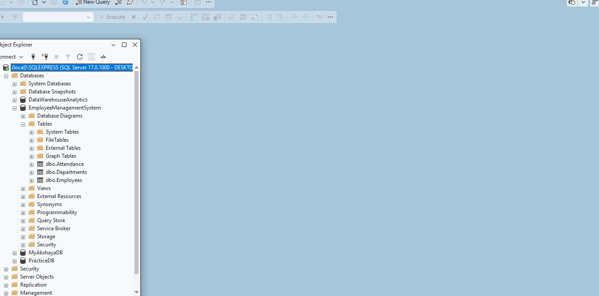

# Employee Management System (SQL)

## Project Overview
This project is an Employee Management System developed using SQL Server. It demonstrates database design, table creation, and SQL queries for managing employee information.

## Features
- Employee Management
- Department Management
- Attendance Management
- SQL Queries for Data Analysis

## Tools Used
- SQL Server Management Studio (SSMS)
- SQL

## Project Files
- EmployeeManagement.sql
- 02_Tables_List.png
- 03_Attendance_data.png
- 04_Departments_Data.png
- 05_Employees_Data.png

## Author
Akshaya Kothakonda# Employee Management System (SQL)

## Project Overview
This project is an Employee Management System developed using SQL Server. It demonstrates database design, table creation, and SQL queries for managing employee information.

## Features
- Employee Management
- Department Management
- Attendance Management
- SQL Queries for Data Analysis

## Tools Used
- SQL Server Management Studio (SSMS)
- SQL

## Project Files
- EmployeeManagement.sql
- 02_Tables_List.png
- 03_Attendance_data.png
- 04_Departments_Data.png
- 05_Employees_Data.png

## Author
Akshaya Kothakonda

## Project Screenshot

